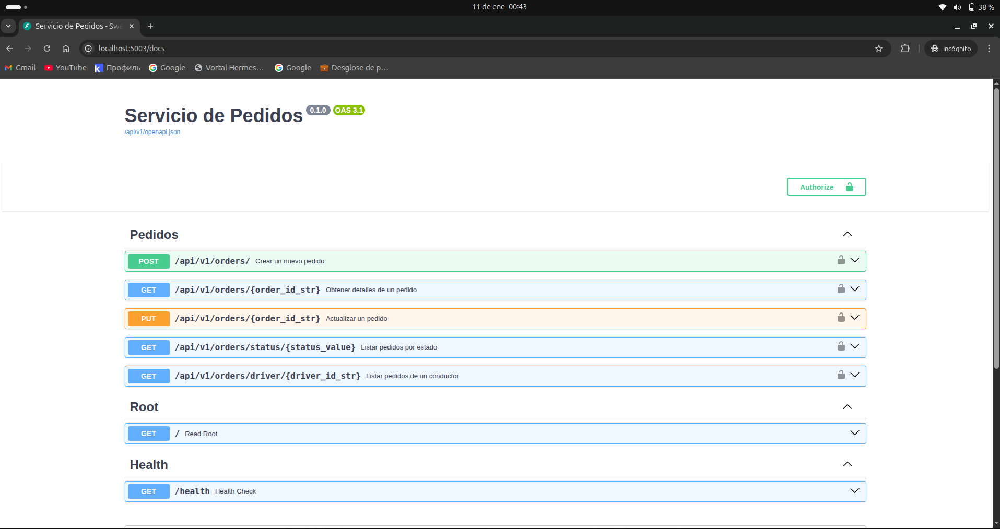
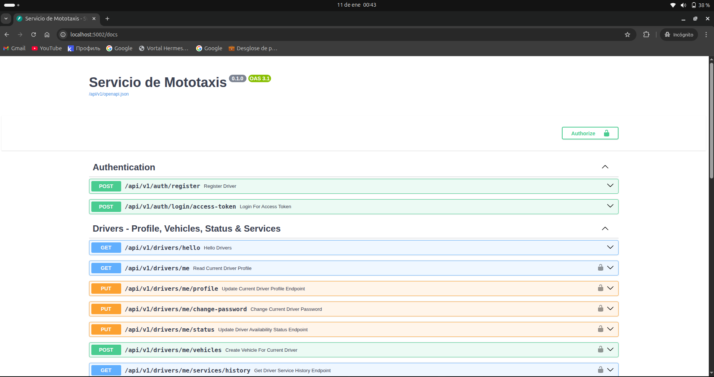
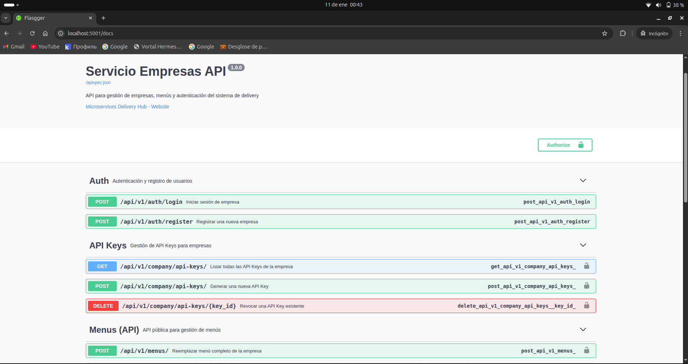
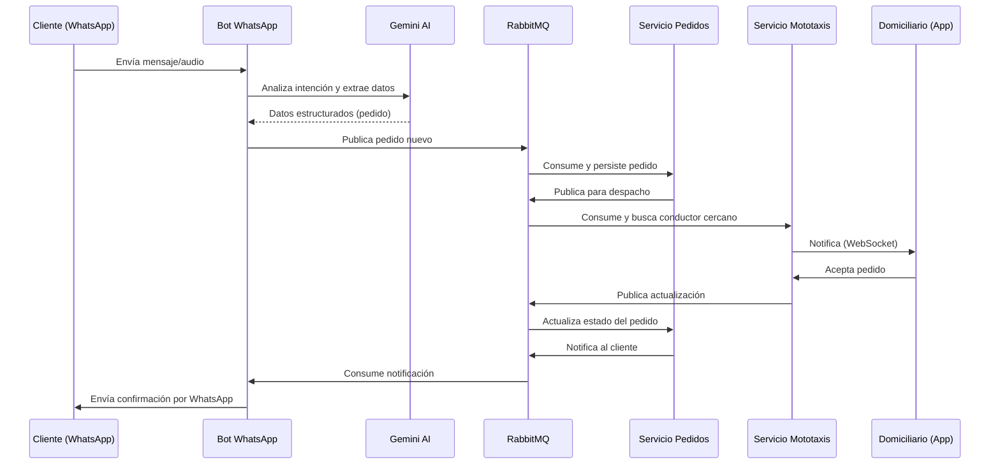

<div align="center">

# 🚀 Microservices Delivery Hub

### **Plataforma Backend de Domicilios y Mototaxi Autónoma con IA**

[](https://python.org)
[](https://fastapi.tiangolo.com)
[](https://docker.com)
[](https://rabbitmq.com)
[](https://postgresql.org)
[](https://mongodb.com)
[](https://redis.io)

<br/>

**Una solución completa de backend basada en microservicios para gestionar servicios de domicilios, entregas y mototaxi de manera autónoma utilizando inteligencia artificial a través de WhatsApp.**

[Arquitectura](#️-arquitectura) •
[Servicios](#-microservicios) •
[Tecnologías](#️-stack-tecnológico) •
[Instalación](#-instalación) •
[API](#-endpoints-principales)

</div>

---

## 📸 Screenshots de los Servicios

<div align="center">
<table>
  <tr>
    <td align="center" width="50%">
      
      <br/>
      <strong>🤖 Bot WhatsApp</strong>
      <br/>
      <em>Interacción con IA vía WhatsApp</em>
    </td>
    <td align="center" width="50%">
      
      <br/>
      <strong>📋 Servicio Pedidos</strong>
      <br/>
      <em>Gestión de órdenes y transacciones</em>
    </td>
  </tr>
  <tr>
    <td align="center" width="50%">
      
      <br/>
      <strong>🏍️ Servicio Mototaxis</strong>
      <br/>
      <em>Tracking en tiempo real de conductores</em>
    </td>
    <td align="center" width="50%">
      
      <br/>
      <strong>🏢 Servicio Empresas</strong>
      <br/>
      <em>Gestión de negocios y menús</em>
    </td>
  </tr>
</table>
</div>

---

## 📋 Tabla de Contenidos

- [Visión del Proyecto](#-visión-del-proyecto)
- [Arquitectura](#️-arquitectura)
- [Microservicios](#-microservicios)
- [Stack Tecnológico](#️-stack-tecnológico)
- [Justificación de Tecnologías](#-justificación-de-tecnologías)
- [Instalación](#-instalación)
- [Configuración](#️-configuración)
- [Comandos Makefile](#-comandos-makefile)
- [Endpoints Principales](#-endpoints-principales)
- [CI/CD](#-cicd)
- [Ecosistema Completo](#-ecosistema-completo)
- [Roadmap](#-roadmap)

---

## 🎯 Visión del Proyecto

**Microservices Delivery Hub** es el **backend central** de una plataforma revolucionaria que busca automatizar completamente los servicios de domicilios y mototaxi mediante **inteligencia artificial**.

### ¿Cómo funciona?

1. **El cliente** interactúa con un **bot de WhatsApp** para solicitar servicios (pedidos de comida, transporte en mototaxi, compras, etc.)
2. **La IA (Gemini)** procesa el mensaje del cliente, extrae la información relevante y gestiona la conversación de forma natural
3. **El sistema** asigna automáticamente el conductor más cercano y disponible
4. **El conductor** recibe la notificación en su **aplicación móvil** y acepta/rechaza el pedido
5. **Las empresas** (restaurantes, comercios) gestionan sus menús y pedidos desde el **panel web**

### Componentes del Ecosistema

| Componente | Descripción | Estado |
|------------|-------------|--------|
| 🔧 **Backend (Este Repo)** | Microservicios para gestión de pedidos, empresas, conductores y bot de WhatsApp | ✅ En desarrollo |
| 🌐 **Frontend Web** | Panel de administración para empresas (gestión de menús, pedidos, reportes) | 🔜 Próximamente |
| 📱 **App Móvil** | Aplicación para domiciliarios y mototaxistas (recibir pedidos, navegación, earnings) | 🔜 Próximamente |

---

## 🏗️ Arquitectura

El proyecto sigue una **arquitectura de microservicios event-driven**, diseñada para alta escalabilidad, resiliencia y mantenibilidad.

```
                                    ┌─────────────────┐
                                    │   WhatsApp API  │
                                    │    (Twilio)     │
                                    └────────┬────────┘
                                             │
                                             ▼
┌─────────────────────────────────────────────────────────────────────────────────┐
│                              🤖 Bot WhatsApp Service                            │
│  ┌─────────────┐  ┌─────────────┐  ┌─────────────┐  ┌─────────────────────────┐ │
│  │   Webhook   │  │   Gemini    │  │   Whisper   │  │   Session Manager       │ │
│  │   Handler   │──│   Analyzer  │  │   STT       │  │   (Redis)               │ │
│  └─────────────┘  └─────────────┘  └─────────────┘  └─────────────────────────┘ │
└────────────────────────────────────┬────────────────────────────────────────────┘
                                     │ RabbitMQ
                                     ▼
┌───────────────────────────────────────────────────────────────────────────────────┐
│                            📦 Message Broker (RabbitMQ)                           │
│  ┌────────────────────┐  ┌────────────────────┐  ┌────────────────────────────┐   │
│  │  pedidos_exchange  │  │  dispatch_exchange │  │  incoming_messages_exchange│   │
│  └────────────────────┘  └────────────────────┘  └────────────────────────────┘   │
└───────────────────────────┬───────────────────────────┬───────────────────────────┘
                            │                           │
              ┌─────────────┴──────────┐    ┌───────────┴──────────┐
              ▼                        ▼    ▼                      ▼
┌─────────────────────────┐    ┌─────────────────────────┐    ┌───────────────────┐
│   📋 Servicio Pedidos   │    │   🏍️ Servicio Mototaxis │    │  🏢 Servicio      │
│   (FastAPI + Uvicorn)   │    │   (FastAPI + Uvicorn)   │    │     Empresas      │
│   ┌─────────────────┐   │    │   ┌─────────────────┐   │    │  (Flask + Hyper)  │
│   │   PostgreSQL    │   │    │   │   PostgreSQL    │   │    │ ┌─────────────┐   │
│   │  (pedidos_db)   │   │    │   │ (mototaxis_db)  │   │    │ │   MongoDB   │   │
│   └─────────────────┘   │    │   └─────────────────┘   │    │ │ (db_empresa)│   │
│                         │    │   ┌─────────────────┐   │    │ └─────────────┘   │
│                         │    │   │     Redis       │   │    │                   │
│                         │    │   │ (ubicaciones)   │   │    │                   │
│                         │    │   └─────────────────┘   │    │                   │
│                         │    │   ┌─────────────────┐   │    │                   │
│                         │    │   │   WebSockets    │   │    │                   │
│                         │    │   └─────────────────┘   │    │                   │
└─────────────────────────┘    └─────────────────────────┘    └───────────────────┘
```

### Flujo de un Pedido



---

## 📦 Microservicios

### 1. 🤖 Bot WhatsApp (`servicio_bot_whatsapp`)

**El cerebro de interacción con el usuario.** Gestiona toda la comunicación con clientes a través de WhatsApp usando la API de Twilio.

| Característica | Descripción |
|----------------|-------------|
| **Framework** | Flask + Gunicorn |
| **IA Conversacional** | Google Gemini 2.0 Flash |
| **Speech-to-Text** | Faster Whisper (optimizado para CPU) |
| **Sesiones** | Redis (manejo de contexto conversacional) |
| **Mensajería** | RabbitMQ (comunicación asíncrona) |

**Funcionalidades:**
- ✅ Recepción de mensajes de texto y audio
- ✅ Transcripción de notas de voz con Whisper
- ✅ Análisis de intención con Gemini AI
- ✅ Extracción automática de datos del pedido
- ✅ Gestión de flujo conversacional multi-turno
- ✅ Rate limiting por usuario
- ✅ Dead Letter Queue para mensajes fallidos

---

### 2. 📋 Servicio Pedidos (`servicio_pedidos`)

**El núcleo transaccional del sistema.** Gestiona el ciclo de vida completo de los pedidos.

| Característica | Descripción |
|----------------|-------------|
| **Framework** | FastAPI + Uvicorn |
| **Base de Datos** | PostgreSQL (async con asyncpg) |
| **ORM** | SQLAlchemy 2.0 (async) |
| **Migraciones** | Alembic |
| **Mensajería** | aio-pika (RabbitMQ async) |

**Funcionalidades:**
- ✅ CRUD de pedidos
- ✅ Máquina de estados para pedidos (nuevo → asignado → en_camino → entregado)
- ✅ Consumidores async de RabbitMQ
- ✅ Publicación de eventos para despacho
- ✅ Notificaciones al cliente

---

### 3. 🏍️ Servicio Mototaxis (`servicio_mototaxis`)

**Gestión de conductores en tiempo real.** Maneja el registro, autenticación y asignación de domiciliarios/mototaxistas.

| Característica | Descripción |
|----------------|-------------|
| **Framework** | FastAPI + Uvicorn |
| **Base de Datos** | PostgreSQL |
| **Cache de Ubicaciones** | Redis (geolocalización en tiempo real) |
| **Comunicación Real-time** | WebSockets |
| **Autenticación** | JWT (python-jose) |

**Funcionalidades:**
- ✅ Registro y autenticación de conductores
- ✅ Tracking de ubicación en tiempo real (Redis geospatial)
- ✅ Asignación automática por proximidad
- ✅ Notificaciones push via WebSocket
- ✅ Estados de disponibilidad (disponible, ocupado, offline)
- ✅ Historial de viajes y earnings

---

### 4. 🏢 Servicio Empresas (`servicio_empresas`)

**Gestión de negocios y catálogos.** Administra restaurantes, comercios y sus productos/menús.

| Característica | Descripción |
|----------------|-------------|
| **Framework** | Flask (async) + Hypercorn |
| **Base de Datos** | MongoDB (Motor async driver) |
| **Autenticación** | JWT (Flask-JWT-Extended) |
| **Validación** | Pydantic v2 |

**Funcionalidades:**
- ✅ CRUD de empresas/restaurantes
- ✅ Gestión de menús flexibles (JSON schema-free)
- ✅ Categorías y productos anidados
- ✅ Gestión de horarios de atención
- ✅ Multi-tenancy por empresa

---

## 🛠️ Stack Tecnológico

### Lenguajes y Frameworks

| Tecnología | Uso | Versión |
|------------|-----|---------|
|  | Lenguaje principal | 3.11+ |
|  | API REST (pedidos, mototaxis) | 0.100+ |
|  | API REST (bot, empresas) | 3.1+ |

### Bases de Datos

| Tecnología | Uso | Versión |
|------------|-----|---------|
|  | Datos transaccionales (pedidos, conductores) | 16 |
|  | Datos flexibles (menús, catálogos) | 7.0 |
|  | Cache, sesiones, geolocalización | 7 |

### Mensajería e Infraestructura

| Tecnología | Uso | Versión |
|------------|-----|---------|
|  | Message broker (event-driven) | 3.13 |
|  | Containerización | 24+ |
|  | Orquestación local | 2.0+ |

### Inteligencia Artificial

| Tecnología | Uso |
|------------|-----|
|  | Análisis de intención y extracción de datos |
|  | Speech-to-Text para notas de voz |

### Integraciones

| Tecnología | Uso |
|------------|-----|
|  | WhatsApp Business API |

---

## 💡 Justificación de Tecnologías

### ¿Por qué MongoDB para los menús de restaurantes?

> **Flexibilidad de esquema es clave para menús de restaurantes.**

Los menús de restaurantes son inherentemente variables:
- Un restaurante puede tener pizzas con múltiples tamaños y toppings
- Otro puede tener combos con opciones de bebida y acompañamiento
- Los platos pueden tener modificadores, alérgenos, opciones vegetarianas, etc.

```javascript
// Ejemplo de documento de menú en MongoDB
{
  "_id": "restaurante_123",
  "nombre": "Pizzería Roma",
  "categorias": [
    {
      "nombre": "Pizzas",
      "productos": [
        {
          "nombre": "Margherita",
          "precios": { "personal": 15000, "mediana": 25000, "grande": 35000 },
          "toppings_extra": ["pepperoni", "champiñones", "aceitunas"],
          "modificadores": ["sin cebolla", "extra queso"]
        }
      ]
    },
    {
      "nombre": "Bebidas",
      "productos": [
        { "nombre": "Coca-Cola", "tamaños": ["350ml", "500ml", "1.5L"] }
      ]
    }
  ]
}
```

**Con PostgreSQL** necesitaríamos múltiples tablas relacionadas (productos, categorías, modificadores, precios_por_tamaño, etc.) y consultas JOIN complejas. **MongoDB** nos permite almacenar toda la estructura del menú en un solo documento, facilitando:

- ✅ Lectura ultra-rápida del menú completo
- ✅ Actualizaciones atómicas de categorías/productos
- ✅ Esquema flexible por restaurante
- ✅ Fácil versionamiento de menús

---

### ¿Por qué PostgreSQL para pedidos y conductores?

> **Integridad transaccional es crítica para operaciones financieras.**

Los pedidos y la gestión de conductores requieren:
- **Transacciones ACID** para garantizar que un pedido no se duplique ni se pierda
- **Relaciones fuertes** entre pedidos, conductores, clientes
- **Consultas complejas** para reportes y analytics

```sql
-- Ejemplo: Obtener earnings de un conductor con transacciones atómicas
BEGIN;
  UPDATE pedidos SET estado = 'entregado' WHERE id = $1;
  UPDATE conductores SET total_viajes = total_viajes + 1 WHERE id = $2;
  INSERT INTO pagos (conductor_id, monto, fecha) VALUES ($2, $3, NOW());
COMMIT;
```

---

### ¿Por qué Redis para ubicaciones en tiempo real?

> **Velocidad y estructuras geoespaciales nativas.**

Redis ofrece:
- **GEOADD/GEORADIUS**: Búsqueda de conductores por proximidad en O(log(N))
- **Latencia sub-milisegundo**: Crítico para tracking en tiempo real
- **TTL automático**: Expiración de ubicaciones obsoletas

```redis
# Agregar ubicación del conductor
GEOADD driver_locations -75.5658 6.2442 "conductor:123"

# Buscar conductores en radio de 2km
GEORADIUS driver_locations -75.5658 6.2442 2 km WITHDIST ASC
```

---

### ¿Por qué RabbitMQ y no Kafka?

> **Simplicidad y patrones de mensajería flexibles.**

Para este caso de uso, RabbitMQ es ideal porque:
- **Routing flexible** con exchanges (topic, direct, fanout)
- **Dead Letter Queues** para reintentos automáticos
- **Menor overhead operacional** que Kafka
- **Confirmación de mensajes** (ack/nack) granular

El volumen esperado de mensajes (< 10,000/min) no justifica la complejidad de Kafka.

---

### ¿Por qué Faster Whisper en lugar de OpenAI Whisper?

> **Optimización para CPU y menor consumo de memoria.**

Faster Whisper usa CTranslate2, lo que proporciona:
- **4x más rápido** que la implementación original de OpenAI
- **Menor consumo de RAM** (ideal para contenedores con límites de memoria)
- **Funciona en CPU** sin necesidad de GPU

```python
# Configuración optimizada para CPU
model = WhisperModel("small", device="cpu", compute_type="int8")
```

---

### ¿Por qué Gemini AI?

> **JSON mode nativo y excelente relación costo/rendimiento.**

Gemini 2.0 Flash ofrece:
- **`response_mime_type: application/json`** garantiza salida JSON válida siempre
- **Latencia baja** (~200ms promedio)
- **Costo efectivo** para alto volumen de requests
- **Context window amplio** para conversaciones multi-turno

---

## 🚀 Instalación

### Prerrequisitos

- Docker 24+ y Docker Compose 2.0+
- Make (opcional, pero recomendado)
- Git

### Clonar el repositorio

```bash
git clone https://github.com/tu-usuario/microservices-delivery-hub.git
cd microservices-delivery-hub
```

### Configurar variables de entorno

```bash
# Crear archivo .env desde el ejemplo
make env-setup
# O manualmente:
cp .env.example .env

# Editar .env con tus credenciales
nano .env
```

### Variables de entorno requeridas

```env
# === CREDENCIALES OBLIGATORIAS ===
POSTGRES_PASSWORD=tu_contraseña_segura
MONGO_ROOT_PASSWORD=tu_contraseña_segura

# Twilio (WhatsApp)
TWILIO_ACCOUNT_SID=ACxxxxxxxxxxxxxx
TWILIO_AUTH_TOKEN=xxxxxxxxxxxxxx
TWILIO_WHATSAPP_NUMBER=whatsapp:+14155238886

# Gemini AI
GEMINI_API_KEY=AIzaxxxxxxxxxxxxxxxx

# JWT Secrets (genera valores seguros)
EMPRESAS_SECRET_KEY=genera_un_secret_seguro_256_bits
EMPRESAS_JWT_SECRET_KEY=genera_otro_secret_seguro
PEDIDOS_SECRET_KEY=genera_otro_secret_seguro
MOTOTAXIS_JWT_SECRET_KEY=genera_otro_secret_seguro
```

### Levantar todos los servicios

```bash
# Construir y levantar
make up-build

# O solo levantar (si ya están construidos)
make up

# Ver estado de los servicios
make ps

# Ver logs en tiempo real
make logs
```

---

## ⚙️ Configuración

### Estructura de archivos de configuración

```
microservices-delivery-hub/
├── .env                    # Variables de entorno (no commitear)
├── .env.example            # Plantilla de variables
├── docker-compose.yml      # Orquestación de servicios
├── Makefile               # Comandos de desarrollo
├── pyproject.toml         # Configuración de linters (Ruff, Black)
└── docker/
    ├── postgres/init/     # Scripts de inicialización de DBs
    └── mongo/init/        # Scripts de inicialización de MongoDB
```

### Puertos por defecto

| Servicio | Puerto | Descripción |
|----------|--------|-------------|
| Bot WhatsApp | 5000 | Webhook de Twilio |
| Servicio Empresas | 5001 | API REST |
| Servicio Mototaxis | 5002 | API REST + WebSocket |
| Servicio Pedidos | 5003 | API REST |
| RabbitMQ Management | 15672 | Panel de administración |
| PostgreSQL | 5432 | Base de datos |
| MongoDB | 27017 | Base de datos |
| Redis | 6379 | Cache |

---

## 📋 Comandos Makefile

```bash
# === DOCKER ===
make up              # Levantar todos los servicios
make up-build        # Construir y levantar
make down            # Detener todos los servicios
make down-v          # Detener y eliminar volúmenes
make ps              # Ver estado de servicios
make logs            # Ver logs de todos los servicios
make logs-<servicio> # Ver logs de un servicio específico

# === CONSTRUCCIÓN ===
make build           # Construir todas las imágenes
make build-<servicio> # Construir un servicio específico
make rebuild         # Reconstruir sin cache

# === DESARROLLO ===
make shell-<servicio> # Abrir shell en un contenedor
make psql            # Conectar a PostgreSQL
make mongo-shell     # Conectar a MongoDB
make redis-cli       # Conectar a Redis

# === CALIDAD DE CÓDIGO ===
make lint            # Ejecutar Ruff linter
make lint-fix        # Corregir errores automáticamente
make format          # Formatear código con Black
make quality         # Ejecutar todas las validaciones

# === UTILIDADES ===
make health          # Verificar salud de servicios
make clean           # Limpiar recursos Docker no usados
make env-setup       # Crear .env desde ejemplo
```

---

## 🔌 Endpoints Principales

### Bot WhatsApp (`:5000`)

| Método | Endpoint | Descripción |
|--------|----------|-------------|
| POST | `/webhook` | Recibe mensajes de Twilio |
| GET | `/health` | Health check |

### Servicio Empresas (`:5001`)

| Método | Endpoint | Descripción |
|--------|----------|-------------|
| POST | `/api/v1/auth/login` | Login de empresa |
| GET | `/api/v1/empresas` | Listar empresas |
| GET | `/api/v1/menus/{empresa_id}` | Obtener menú |
| PUT | `/api/v1/menus/{empresa_id}` | Actualizar menú |

### Servicio Pedidos (`:5003`)

| Método | Endpoint | Descripción |
|--------|----------|-------------|
| POST | `/api/v1/pedidos` | Crear pedido |
| GET | `/api/v1/pedidos/{id}` | Obtener pedido |
| PATCH | `/api/v1/pedidos/{id}/estado` | Actualizar estado |

### Servicio Mototaxis (`:5002`)

| Método | Endpoint | Descripción |
|--------|----------|-------------|
| POST | `/api/v1/auth/register` | Registrar conductor |
| POST | `/api/v1/auth/login` | Login conductor |
| WS | `/ws/driver/{driver_id}` | WebSocket de conductor |
| POST | `/api/v1/location` | Actualizar ubicación |

---

## 🔄 CI/CD

El proyecto incluye GitHub Actions para validación automática:

### Pull Request Validation

```yaml
# .github/workflows/pr-validation.yml
- Linting con Ruff
- Construcción de imágenes Docker
- Validación de docker-compose
```

### Deploy (Configurar según tu infraestructura)

```yaml
# .github/workflows/deploy.yml
- Build y push a registro de contenedores
- Deploy a Kubernetes/ECS/etc
```

---

## 🌐 Ecosistema Completo

Este backend es parte de un ecosistema más grande:

```
┌─────────────────────────────────────────────────────────────────────────┐
│                         ECOSISTEMA COMPLETO                             │
├─────────────────────────────────────────────────────────────────────────┤
│                                                                         │
│   ┌─────────────┐     ┌─────────────────────────────────────────────┐  │
│   │  Cliente    │     │           BACKEND (Este Repo)               │  │
│   │  WhatsApp   │◄───►│  ┌───────────┐ ┌───────────┐ ┌──────────┐  │  │
│   └─────────────┘     │  │Bot WhatsApp│ │ Pedidos   │ │ Empresas │  │  │
│                       │  └───────────┘ └───────────┘ └──────────┘  │  │
│   ┌─────────────┐     │  ┌───────────┐                             │  │
│   │  Panel Web  │◄───►│  │ Mototaxis │                              │  │
│   │  Empresas   │     │  └───────────┘                              │  │
│   └─────────────┘     └─────────────────────────────────────────────┘  │
│                                                                         │
│   ┌─────────────┐                                                       │
│   │  App Móvil  │◄──────── WebSocket/REST ────────────────────────────►│
│   │ Conductores │                                                       │
│   └─────────────┘                                                       │
│                                                                         │
└─────────────────────────────────────────────────────────────────────────┘
```

### Frontend Web (Próximamente)

Panel de administración para empresas:
- Dashboard con métricas en tiempo real
- Gestión de menús drag-and-drop
- Historial de pedidos
- Reportes y analytics
- Configuración de horarios

### App Móvil (Próximamente)

Aplicación para domiciliarios/mototaxistas:
- Notificaciones push de nuevos pedidos
- Navegación GPS integrada
- Estado de disponibilidad
- Historial de viajes y earnings
- Chat con soporte

---

## 📍 Roadmap

- [x] Arquitectura base de microservicios
- [x] Bot de WhatsApp con Gemini AI
- [x] Transcripción de audio con Faster Whisper
- [x] Gestión de pedidos con PostgreSQL
- [x] Gestión de conductores con ubicación en tiempo real
- [x] Gestión de empresas y menús con MongoDB
- [x] Comunicación event-driven con RabbitMQ
- [x] CI/CD con GitHub Actions
- [ ] Frontend web para empresas
- [ ] App móvil para conductores
- [ ] Sistema de pagos integrado
- [ ] Analytics y reportes avanzados
- [ ] Notificaciones push móviles
- [ ] Multi-idioma

---

## 🤝 Contribución

Las contribuciones son bienvenidas. Por favor:

1. Fork el repositorio
2. Crea una rama (`git checkout -b feature/nueva-funcionalidad`)
3. Commit tus cambios (`git commit -m 'feat: añadir nueva funcionalidad'`)
4. Push a la rama (`git push origin feature/nueva-funcionalidad`)
5. Abre un Pull Request

### Convención de commits

Seguimos [Conventional Commits](https://www.conventionalcommits.org/):

- `feat:` Nueva funcionalidad
- `fix:` Corrección de bug
- `docs:` Documentación
- `refactor:` Refactorización
- `test:` Tests
- `chore:` Tareas de mantenimiento

---

## 👤 Autor

<p align="center">
  
</p>

<h3 align="center">Andrés Felipe Tapasco Garzón</h3>
<p align="center"><em>Full Stack Developer & Systems Engineer</em></p>

<p align="center">
  <a href="https://www.linkedin.com/in/andres-felipe-tapasco-garzon-59b24624b">
    
  </a>
  <a href="https://github.com/pipetapasco">
    
  </a>
  <a href="mailto:pipetapasco21@gmail.com">
    
  </a>
</p>

---

<p align="center">
  <strong>⭐ Si este proyecto te resultó útil, considera darle una estrella en GitHub ⭐</strong>
</p>

<p align="center">
  Made with ❤️ and ☕ in Colombia 🇨🇴
</p>
